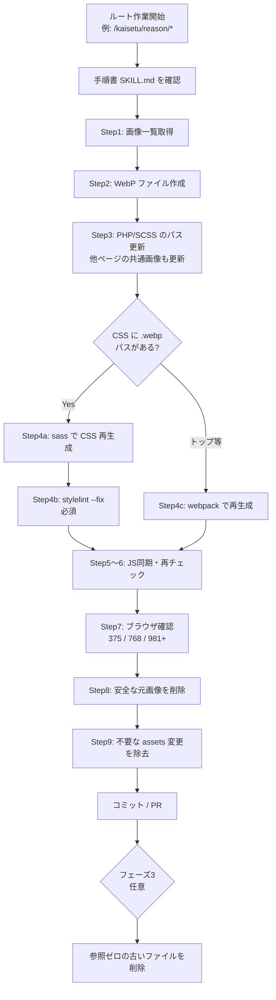

# Kaisetu WebP 変換ガイド（日本語）— ディレクター・エンジニア向け

<aside>
📘

**対象読者：** Webディレクター、フロントエンジニア、レビュー担当者

**前提知識：** 不要（画像形式やビルドの詳細がわからなくても読めます）

**英語版（詳細・技術メモ）：** [Kaisetu WebP Conversion — Tooling & Artifacts](https://app.notion.com/p/Kaisetu-WebP-Conversion-Tooling-Artifacts-368c16915849819eb3bef091e642a7a9?pvs=21)

**最終更新：** 2026-06-02

</aside>

## 1. 30秒でわかる概要

| **項目** | **内容** |
| --- | --- |
| 何をしているか | `/kaisetu/` 配下ページで使っている **PNG / JPG / SVG 画像** を、より軽い **WebP** 形式に置き換える |
| なぜやるか | 画像ファイルが小さくなり、**ページ表示が速くなる**（特にスマホ） |
| どこを触るか | 画像ファイル本体 + それを参照している **PHP / SCSS / CSS** など |
| 触らないもの | GIF、外部CDNの画像、WordPressアップロード画像、PHP内のインラインSVGコード |
| 進捗 | フェーズ1（トップ）完了 / フェーズ2 **reason 完了** / service・style は未着手 / フェーズ3は任意のお掃除 |

---

## 2. WebPって何？（ディレクター向け）

**WebP（ウェッピー）** は、Google が普及させた **写真・イラスト向けの新しい画像形式** です。

- **見た目：** 人間の目では、元の PNG/JPG と **ほぼ同じ** に見えます
- **ファイルサイズ：** だいたい **20〜40% 小さく** なることが多い
- **サイトへの効果：** 画像の読み込みが速くなり、**表示速度の改善** につながります

**このプロジェクトでやっていることは「画像の中身を軽くする」だけではありません。** ページの HTML や CSS に書いてある **画像のパス（ファイル名）** も `.webp` に合わせて書き換える必要があります。パスだけ変えて画像が残っている、またはその逆だと **画像が表示されない** ページが出ます。

---

## 3. 3つのフェーズ（全体計画）

| **フェーズ** | **誰にとってわかりやすい説明** | **状態** |
| --- | --- | --- |
| **フェーズ1** | `/kaisetu/` トップページの試験導入。手順とツールの動作確認 | ✅ 完了 |
| **フェーズ2** | 他の `/kaisetu/*` ページを **ルート（ページ群）単位** で順次変換。1ルートごとに「変換 → 参照更新 → 確認 → 元画像削除」まで完了 | reason ✅ 完了 / service・style ⏳ 未着手 |
| **フェーズ3** | ***どこ*からも参照されていない** 古い画像ファイルのお掃除（任意）。通常の変換作業とは別タイミング | ⏳ 未実施（フェーズ2の後） |

<aside>
💡

**ポイント（2026-06 方針変更）：** 以前は「元の PNG/JPG を最後にまとめて削除」でしたが、今は **フェーズ1・2の各ルート作業の最後** で、安全確認が取れたものから **元画像を削除** します。フェーズ3は「迷子になったファイル」の整理用です。

</aside>

### フェーズ2で完了済み：reason グループ

- `/kaisetu/reason/` および配下 8 ページ（ibjsystem, support, kameiflow など計9ページ）
- ページ専用フォルダ以外（`kameisystem/` など）の **共通画像** も対象に含めて変換済み

---

## 4. 1ルートあたりの作業の流れ（9ステップ）

エンジニアが1ページ群（例：`/kaisetu/reason/*`）を変換するときの **決まった手順** です。ディレクターは **太字の確認ポイント** だけ押さえれば十分です。

| **Step** | **エンジニアがやること** | **ディレクター確認** |
| --- | --- | --- |
| 1 | 対象ページが使っている画像一覧をスクリプトで取得 | — |
| 2 | PNG/JPG/SVG → WebP ファイルを **新規作成**（元ファイルはまだ残す） | — |
| 3 | PHP・SCSS 等の **参照パスを .webp に更新**。他ページで同じ画像を使っていれば **そちらも更新** | — |
| 4 | CSS を再生成（sass 使用時は **stylelint 修正も必須** → セクション7参照） | — |
| 5 | 必要なら JS ファイルを同期 | — |
| 6 | 再度スクリプトで「古い形式の参照が残っていないか」確認 | — |
| 7 | ブラウザ確認（スマホ375px / タブレット768px / PC981px以上） | **✅ 画像が欠けていないか、レイアウト崩れがないか** |
| 8 | どこからも参照されていない元 PNG/JPG/SVG を削除 | — |
| 9 | 関係ない CSS/JS の変更が混ざっていないか整理してからコミット | — |

### フロー図



---

## 5. 使うファイル・ツール（何がどこにあるか）

「Cursor（AIエディタ）の設定ファイル」と「リポジトリ内のスクリプト」に分かれます。**作業の起点は [SKILL.md](http://SKILL.md)（手順書）** です。

| **順番** | **ファイル / ツール** | **役割（平易な説明）** |
| --- | --- | --- |
| 0 | `.cursor/rules/kaisetu-webp-migration.mdc` | **ルール集** — AI・人が守るべき禁止事項（触ってはいけないもの等） |
| 1 | `.cursor/skills/kaisetu-webp-conversion/SKILL.md` | **メイン手順書** — 9ステップの詳細。エンジニアはここから開始 |
| 1 | `kaisetu-pack/scripts/inventory-images.mjs` | 対象ページが **どの画像を使っているか一覧化** |
| 2 | `kaisetu-pack/scripts/convert-to-webp.mjs` | WebP ファイルを **自動生成** |
| 3 | PHP / SCSS / JS（手動または補助スクリプト） | コード内の画像パスを `.webp` に **書き換え** |
| 4a | `npx sass` | SCSS から CSS を **再生成**（.webp 対応のため webpack より優先されることが多い） |
| 4b | `kaisetu-pack/.stylelintrc.json`  • `stylelint --fix` | CSS の **書式チェック・自動修正**（sass 後は必須 → セクション7） |
| 4c | `kaisetu-pack/webpack.pilot.config.js` | トップページ用 CSS だけを **限定再ビルド** |
| 9 | clean-kaisetu-asset-rebuilds スキル | 関係ない CSS/JS の差分を **コミット前に除去** |
- エンジニア向け：よく使うコマンド例
    
    ```bash
    cd kaisetu-pack
    # 1. 一覧
    node scripts/inventory-images.mjs --route kaisetu-reason --json
    # 2. 変換
    node scripts/convert-to-webp.mjs --route kaisetu-reason
    # 4. CSS 再生成 + lint（sass 使用時）
    npx sass src/page/ibjsystem.scss assets/ibjsystem.css --style=compressed --no-source-map
    npx stylelint --fix assets/ibjsystem.css assets/kaisetu_page.css
    # CI と同じ確認（リポジトリルート）
    npm run stylelintKaisetu
    ```
    

---

## 6. ディレクター向け：公開前チェックリスト

変換 PR が上がったとき、**最低限これだけ確認** すれば十分です。

- [ ]  対象 URL を **スマホ（375px幅）** で開き、**画像がすべて表示** されている
- [ ]  **PC（981px以上）** でも KV・メインビジュアル・本文画像に **欠け・崩れがない**
- [ ]  ブラウザの開発者ツール → Network で、対象ページの **ローカル画像が .webp になっている**（GIF は除く）
- [ ]  **他ページ**（フォーム、サンクスページ等）で同じ画像を使っている場合、そちらも表示 OK
- [ ]  フッターの認証ロゴ（東証・プライバシーマーク）が **表示されている**

---

## 7. CI エラー：`media-feature-colon-space-after`（重要）

<aside>
🚨

**GitLab CI ジョブ名：** `kaisetu-stylelint-job`

**エラーメッセージ例：** `Expected no space after ":"`（`media-feature-colon-space-after`）

**起きやすいファイル：** `kaisetu-pack/assets/ibjsystem.css`、`kaisetu_page.css` など **sass で再生成した CSS**

</aside>

### なぜ起きるのか（かみ砕いた説明）

1. WebP 対応のため、CSS を **webpack ではなく `npx sass` で再生成** することがある
2. **sass が出力する CSS** のメディアクエリ（画面幅の条件）は `@media (max-width: 47.9375em)` のように **コロンの後にスペース** がある
3. **従来 webpack が出力した CSS** は `@media (max-width:47.9375em)` のように **スペースなし**
4. リポジトリの lint ルール（`kaisetu-pack/.stylelintrc.json`）は **「スペース禁止」** と決まっている
5. 結果：**見た目は正常でも CI だけ落ちる**（空白の違いだけ）

### 解決方法（エンジニア作業）

**sass で CSS を作ったら、必ず続けて stylelint を実行** してください。1つの作業として扱います。

```bash
cd kaisetu-pack
npx sass src/page/ibjsystem.scss assets/ibjsystem.css --style=compressed --no-source-map
npx stylelint --fix assets/ibjsystem.css assets/kaisetu_page.css
cd ..
npm run stylelintKaisetu   # CI と同じチェック
```

### ディレクター向けメモ

- **画面表示は変わりません** — CSS の空白ルールを CI 用に合わせているだけです
- PR で `assets/*.css` だけ変更されている場合、エンジニアに「sass 後 stylelint 済みか」を確認すると安全です

### 再発防止

- 手順書 `SKILL.md` の Step 4 に **「sass → stylelint --fix」** を明記済み
- プッシュ前に `npm run stylelintKaisetu` をローカル実行

---

## 8. よくある質問（FAQ）

| **質問** | **回答** |
| --- | --- |
| 元の PNG はいつ消える？ | そのルートの作業完了時。ただし **他ページからまだ参照されている** 場合は消せません |
| reason 以外のページが壊れることは？ | 共通画像を使っている場合、**参照更新を先に全部** 行う設計です。確認 Step 7 で他ページも見ます |
| GIF は変換する？ | **いいえ。** 対象外です |
| 外部 URL の画像は？ | 基本 **触りません**（フッターロゴ2点のみ例外で .webp 化） |
| フェーズ3は誰がやる？ | 任意。参照されていない古いファイルの整理。通常 PR とは別でも可 |

---

## 9. 用語集

| **用語** | **意味** |
| --- | --- |
| WebP | 軽量な画像形式。PNG/JPG の代替 |
| ルート / route | 1回の変換単位（例：`kaisetu-reason` = reason 関連9ページ一式） |
| 参照 / ref | コード内で `img/xxx.png` のように **画像ファイルを指している記述** |
| SCSS / CSS | 見た目を決めるスタイルファイル。背景画像のパスもここに書かれている |
| sass | SCSS を CSS に変換するツール |
| webpack | 従来の CSS/JS ビルドツール（このプロジェクトの標準パイプライン） |
| stylelint | CSS の書式をチェックするツール。CI で自動実行 |
| grep | コード全体から特定の文字列（画像パス等）を **検索** すること |
| orphan（孤児ファイル） | どのコードからも参照されていない **使われていない画像** |

---

## 10. 関連リンク

- **英語版・技術詳細：** [Kaisetu WebP Conversion — Tooling & Artifacts](https://app.notion.com/p/Kaisetu-WebP-Conversion-Tooling-Artifacts-368c16915849819eb3bef091e642a7a9?pvs=21)
- **付録 — ツールファイル全文（ソースコード）：** ページ末尾「§12 付録」を参照（SKILL / ルール / JS スクリプト / stylelint 設定）
- **webpack ノイズ整理スキル：** [Skill: clean-kaisetu-asset-rebuilds（webpack ノイズ整理スキル）](https://app.notion.com/p/Skill-clean-kaisetu-asset-rebuilds-webpack-353c1691584981e8a10bff65aff2ed9a?pvs=21)

---

## 12. 付録 — リポジトリ内ツールファイル（ソースコード）

<aside>
📎

**同期日:** 2026-06-02（`ibjap-design` リポジトリ）

**正:** Git リポジトリが最新。ここは参照用コピーです

**ファイル本文:** リポジトリと同一（英語）。各トグルを開くと **1行説明** と全文ソースを確認できます

</aside>

| **ファイル** | **役割（日本語）** |
| --- | --- |
| [SKILL.md](http://SKILL.md) | メイン手順書（9ステップ） |
| kaisetu-webp-migration.mdc | AI・人向けルール（禁止事項） |
| inventory-images.mjs | 画像一覧スクリプト |
| convert-to-webp.mjs | WebP 変換スクリプト |
| update-refs-webp.mjs | パイロット用参照一括更新 |
| phase3-delete-originals.mjs | フェーズ3 孤児ファイル削除補助（レガシー） |
| .stylelintrc.json | CSS lint 設定（CI） |
| clean-kaisetu-asset-rebuilds | webpack ノイズ整理スキル |
- .cursor/skills/kaisetu-webp-conversion/[SKILL.md](http://SKILL.md)
    
    **役割：** 9ステップのメイン手順書 — 一覧→変換→参照更新→CSS再生成（sass後 stylelint）→確認→元画像削除→コミット前整理。
    
    ```markdown
    ---
    name: kaisetu-webp-conversion
    description: End-to-end WebP migration for kaisetu routes — inventory, convert, update references, rebuild CSS, verify, delete safe originals per route (Phase 1/2); optional Phase 3 orphan .webp or raster/SVG cleanup.
    ---
    
    # Kaisetu WebP Conversion
    
    Migrate local raster and file-based SVG assets under `kaisetu-pack/img/` from PNG/JPG/SVG to WebP and update all references in scoped source files.
    
    **Route scope:** Inventory and convert **every** local `kaisetu-pack/img/...` ref found in the route’s scoped PHP/SCSS/JS files — **any subfolder** (`reason/`, `kameisystem/`, `setumeikai/`, etc.), not only `img/<route-name>/`. After updating scoped files, grep the repo for each converted path and update **all** hits in `wp_core/`, `kaisetu-pack/src/`, `kaisetu-pack/assets/`.
    
    ## Prerequisites
    
    - `npm install` in `kaisetu-pack/` (`sharp` devDependency required for SVG; script falls back to system `cwebp` for PNG/JPG only on Node 12)
    - Repo root: `ibjap-design` (contains `kaisetu-pack/webpack.config.js`)
    
    ## Workflow
    
    ```
    
    1. Inventory scoped refs
    2. Convert images to .webp
    3. Update PHP / SCSS / JS references (scoped + repo-wide grep for shared assets)
    4. Rebuild affected CSS only (sass preferred for .webp urls; then stylelint --fix)
    5. Sync new-common.js src → assets (minified)
    6. Re-run inventory (zero png/jpg/svg for local images in scoped files)
    7. Browser verify (375 / 768 / 981+)
    8. Delete safe originals (repo-wide ref grep must pass)
    9. clean-kaisetu-asset-rebuilds before commit
    
    ```
    
    ### Step 1 — Inventory
    
    ```
    
    cd kaisetu-pack
    
    node scripts/inventory-images.mjs --route kaisetu-top --json
    
    ```
    
    Route keys are defined in `scripts/inventory-images.mjs` (`ROUTES`). Add new keys for Phase 2 rollout groups. Each route lists **source files** (templates/styles); the manifest is the **union of all** `kaisetu-pack/img/**` paths those files reference (cross-folder refs included).
    
    **Pass:** `missingOnDisk` is empty. Note any paths that need assets pulled from staging.
    
    Footer certification logos (`logo_tosho`, `logo_privacy`) live in `kaisetu-pack/img/` and use `https://www.ibjapan.com/kaisetu-pack/img/*.webp` in `renewal-footer.php` — convert and update refs even though URLs are absolute.
    
    ### Step 2 — Convert
    
    ```
    
    node scripts/convert-to-webp.mjs --route kaisetu-top
    
    ```
    
    Or use a saved manifest:
    
    ```
    
    node scripts/inventory-images.mjs --route kaisetu-top --json > /tmp/kaisetu-top-manifest.json
    
    node scripts/convert-to-webp.mjs --manifest /tmp/kaisetu-top-manifest.json
    
    ```
    
    **Pass:** `errors` and `missing_source` arrays empty. Original PNG/JPG/SVG remain on disk until **Step 8** (deletion). SVG conversion requires **sharp** (cwebp does not accept SVG).
    
    ### Step 3 — Update references
    
    Start in scoped source files, then grep the **whole repo** for each converted basename and update **every** hit:
    
    - `.png` → `.webp`, `.jpg`/`.jpeg` → `.webp`, local `.svg` → `.webp` for **local** paths only (`/kaisetu-pack/img/...`, `../img/...`, `../../img/...`)
    - Do **not** change existing `.webp` paths
    - Do **not** change **full absolute URLs** (`http://`, `https://`, `//`) — except footer `logo_tosho` / `logo_privacy` in `renewal-footer.php` (same host, `.png` → `.webp`)
    - Do **not** change inline `<svg>` markup or CSS class names (e.g. `.svg-elem-1`)
    - Remove dead `<link rel="preload">` for SVGs that are not displayed anywhere after migration
    - `<source type="image/jpg">` → `type="image/webp"` when srcset is webp
    
    ### Step 4 — Rebuild CSS (sass preferred for `.webp` urls)
    
    For SCSS that references `/kaisetu-pack/img/*.webp` or `../../img/*.webp`, compile with **sass** (webpack `url-loader` omits `.webp` and can leave stale `data:image/png` inlines — see `ibjsystem.css` lesson):
    
    ```
    
    cd kaisetu-pack
    
    npx sass src/page/ibjsystem.scss assets/ibjsystem.css --style=compressed --no-source-map
    
    npx sass src/kaisetu-renewal/kaisetu_page.scss assets/kaisetu_page.css --style=compressed --no-source-map
    
    ```
    
    **Always run stylelint after `npx sass`** on every CSS file you rebuilt (see **Stylelint after sass** below). Skipping this step can fail GitLab CI `kaisetu-stylelint-job`.
    
    For pilot/top entries still on webpack inlining:
    
    ```
    
    npx webpack --config webpack.pilot.config.js --mode production
    
    ```
    
    **SCSS path note:** backgrounds that webpack must resolve should use `../../img/...` from `src/kaisetu-renewal/` (not `/kaisetu-pack/img/...` with `url: true`). KV slides may stay as absolute `/kaisetu-pack/img/...` paths in output CSS.
    
    #### Stylelint after sass (required when using `npx sass`)
    
    **Problem:** CI runs `npm run stylelintKaisetu` → `stylelint 'kaisetu-pack/assets/*.css'` (see repo root `package.json`). `kaisetu-pack/.stylelintrc.json` sets `"media-feature-colon-space-after": "never"` (no space after `:` in media queries).
    
    **What goes wrong:** `npx sass` emits media queries **with** a space after the colon, e.g. `@media (max-width: 47.9375em)`. Webpack-built CSS in this repo typically has **no** space, e.g. `@media (max-width:47.9375em)`. After a sass rebuild, stylelint reports:
    
    ```
    
    media-feature-colon-space-after
    
    Expected no space after ":" (media-feature-colon-space-after)
    
    ```
    
    **Fix immediately after every sass rebuild** (list only the files you changed):
    
    ```
    
    cd kaisetu-pack
    
    npx stylelint --fix assets/ibjsystem.css assets/kaisetu_page.css
    
    ```
    
    From repo root (matches CI):
    
    ```
    
    npm run stylelintKaisetu
    
    # if errors remain on your files:
    
    npx stylelint --fix kaisetu-pack/assets/<your-file>.css
    
    ```
    
    **Pass:** `stylelintKaisetu` exits 0 for all `kaisetu-pack/assets/*.css`.
    
    **Avoid recurrence:**
    - Treat **sass compile + stylelint --fix** as one step — never commit sass output without linting
    - Prefer webpack for bundles that already build cleanly through the existing pipeline; use sass only when `.webp` paths require it
    - This is formatting-only — no front-end visual change; it satisfies CI whitespace rules
    
    ### Step 5 — Sync `new-common.js`
    
    `src/kaisetu-renewal/new-common.js` has **no** webpack entry. After editing src, minify to match `assets/new-common.js` style (single line, `!0` for true, etc.) or copy and run uglify:
    
    ```
    
    npx uglifyjs src/kaisetu-renewal/new-common.js -o assets/new-common.js -c -m
    
    ```
    
    ### Step 6 — Verify inventory
    
    ```
    
    node scripts/inventory-images.mjs --route kaisetu-top --json
    
    ```
    
    **Pass:** no remaining `.png`/`.jpg`/`.svg` refs for local `kaisetu-pack/img/` paths in scoped files (GIF excluded; other absolute URLs excluded except footer `logo_tosho` / `logo_privacy` which must be `.webp`).
    
    ### Step 7 — Browser checklist
    
    | Viewport | Width | Check |
    | -------- | ----- | ----- |
    | Mobile | 375px | KV slider, floating CTA, episode/interview slick arrows, business `<picture>` SP, hamburger logo |
    | Tablet | 768px | Breakpoint transitions, picture srcset |
    | PC | 981px+ | KV PC backgrounds (webp), PC business list, header nav |
    
    Network tab: no `.png`/`.jpg`/`.svg` for scoped local file assets (inline SVG markup OK).
    
    ### Step 8 — Delete safe originals
    
    Last step of the route rollout — include deletions in the **same commit** as conversion when checks pass. See rule `.cursor/rules/kaisetu-webp-migration.mdc` → **Delete originals**.
    
    For each converted asset:
    
    1. Confirm sibling `.webp` exists on disk
    2. `grep` the **entire repo** (`wp_core/`, `kaisetu-pack/src/`, `kaisetu-pack/assets/`) for the old path — zero local-path hits required before delete
    3. If another route still references the raster, update that route’s refs first (or defer deletion until it is converted)
    
    **Do not delete:** GIFs; originals with any remaining local-path refs anywhere in the repo; footer `logo_tosho.png` / `logo_privacy.png` until repo-wide local-ref grep passes.
    
    Orphan cleanup (unreferenced `.webp` or leftover `.png`/`.jpg`/`.jpeg`/`.svg`) belongs in **Phase 3**, not this step — see rule → **Phase 3**.
    
    ### Step 9 — Clean webpack noise
    
    Run **clean-kaisetu-asset-rebuilds** skill: revert `kaisetu-pack/assets/*` where source SCSS/JS was not edited.
    
    ## Phase boundaries
    
    - **Phase 1 (pilot):** `--route kaisetu-top` only — includes convert, ref updates, CSS rebuild, verify, and delete safe originals in one rollout
    - **Phase 2:** other routes — shared `img/` dirs + `module_content.scss` first, then parallel route groups; each route completes the full workflow above (deletion of converted originals is the last step of each route)
    - **Phase 3 (optional):** orphan asset cleanup after rollouts — remove unreferenced `.webp` **or** leftover unreferenced `.png`/`.jpg`/`.jpeg`/`.svg` under `kaisetu-pack/img/` when repo-wide grep shows zero local-path refs (see rule → **Phase 3**). Separate from per-route commits unless the orphan is clearly unrelated to in-flight work.
    
    ## Related
    
    - Rule: `.cursor/rules/kaisetu-webp-migration.mdc`
    - Scripts: `kaisetu-pack/scripts/inventory-images.mjs`, `convert-to-webp.mjs`, `update-refs-webp.mjs`
    - Stylelint config: `kaisetu-pack/.stylelintrc.json` (CI: `npm run stylelintKaisetu`)
    
    ## Troubleshooting
    
    | Issue | Cause | Fix |
    | ----- | ----- | --- |
    | CI `kaisetu-stylelint-job` fails with `media-feature-colon-space-after` | `npx sass` output has space after `:` in `@media (...)`; stylelint rule is `"never"` | `npx stylelint --fix` on rebuilt CSS, then re-run `npm run stylelintKaisetu` |
    | Compiled CSS still has base64 PNG after SCSS → `.webp` | Webpack `url-loader` test regex omits `.webp` | Rebuild that bundle with `npx sass` instead of webpack |
    | SVG conversion fails | Missing `sharp` or old Node | Node 18+; `npm install` in `kaisetu-pack/` |
    | Page broken after deleting raster | Another route still references old path | Repo-wide grep before delete; update cross-route refs first |
    ```
    
- .cursor/rules/kaisetu-webp-migration.mdc
    
    **役割：** AI・人向けルール — 変換対象・禁止事項・ルートごとの削除条件・フェーズ3の整理方針を定義。
    
    ```markdown
    ---
    description: Guardrails for kaisetu-pack WebP migration (PNG/JPG/SVG → WebP, reference updates, targeted webpack)
    globs:
      - kaisetu-pack/**
      - wp_core/wp-content/themes/ibjap/page-kaisetu*.php
      - wp_core/wp-content/themes/ibjap/renewal-*.php
      - wp_core/wp-content/themes/ibjap/kaisetu/**
    alwaysApply: false
    ---
    
    # Kaisetu WebP Migration
    
    ## DO
    
    - Convert `png`, `jpg`, `jpeg`, and local `svg` under `kaisetu-pack/img/` only (decorative / file-based SVGs)
    - **Route scope = all local image refs from scoped source files**, in **any** `kaisetu-pack/img/*` subfolder (`reason/`, `kameisystem/`, `form_kamei/`, etc.) — not only a folder named after the route. Inventory and conversion follow discovered refs, not directory name alone.
    - Update references in **source** files: `kaisetu-pack/src/*.scss`, `kaisetu-pack/src/*.js`, `wp_core/.../*.php`
    - Update `kaisetu-pack/assets/new-common.js` when `src/kaisetu-renewal/new-common.js` changes (no webpack entry for this JS)
    - Set `<source type="image/webp">` when `srcset` points to `.webp`
    - Preserve query strings on paths (e.g. `?20250701`)
    - Rebuild **only** affected CSS for edited SCSS. Prefer **`npx sass`** when output uses `/kaisetu-pack/img/*.webp` paths (webpack `url-loader` does not match `.webp` and can leave stale inlined PNG). Use targeted webpack only for entries that inline non-webp assets or already support the file types in the rule chain.
    - Run inventory before/after: `node kaisetu-pack/scripts/inventory-images.mjs --route <key> --json`
    - Run conversion: `node kaisetu-pack/scripts/convert-to-webp.mjs --route <key>`
    - After refs are updated and verified, **delete safe originals** for that route (see **Delete originals** below) — same PR/commit as conversion when checks pass
    - Before commit: use **clean-kaisetu-asset-rebuilds** to revert unrelated `kaisetu-pack/assets/` webpack noise
    
    ## DO NOT
    
    - Convert or rewrite **full absolute URLs** (`http://`, `https://`, or `//`) — except the two footer certification logos below.
      - **Exception (convert to `.webp` on same host/path):** `renewal-footer.php` — `logo_tosho.webp`, `logo_privacy.webp` at `https://www.ibjapan.com/kaisetu-pack/img/...` (sources live in `kaisetu-pack/img/`).
      - All other absolute upload/CDN URLs stay unchanged.
    - Touch **GIF** assets (still excluded from conversion)
    - Change **inline `<svg>` markup** in PHP (e.g. ribbon paths in `page-kaisetu.php`) — not file assets
    - Change external CDN or WordPress upload URLs
    - Edit compiled CSS except syncing `assets/new-common.js`
    - Re-convert or change paths already ending in `.webp` (`kv_*`, `bubble_girl-*`, etc.)
    - Run full `webpack --watch` across all entries
    - Delete original PNG/JPG/SVG before repo-wide ref grep and verification pass (see **Delete originals** below)
    - Commit unrelated asset rebuilds from other webpack entries
    
    ## Delete originals (per route — end of Phase 1 / Phase 2 rollout)
    
    Deletion is the **last step of each route rollout**, not a separate cleanup phase. `convert-to-webp.mjs` only creates `.webp` siblings; delete originals manually after refs and CSS are synced.
    
    Delete the matching original under `kaisetu-pack/img/` when **all** are true:
    
    1. **Sibling WebP exists** — same directory and basename (e.g. `floating.webp` beside `floating.png`)
    2. **No repo-wide local references** — `grep` in `wp_core/`, `kaisetu-pack/src/`, `kaisetu-pack/assets/` finds zero hits for the old extension path (`/kaisetu-pack/img/...`, `../img/...`, `../../img/...`). Ignore lines that are only full `http://` / `https://` / `//` URLs. **Do not limit grep to the route’s scoped files** — shared assets (e.g. `img/kameisystem/`, `img/form_kamei/`) must have **all** cross-route refs updated first.
    3. **Route rollout complete for that asset** — inventory re-run passes; affected CSS/JS rebuilt; browser spot-check done for the route
    
    **Still keep (do not delete):**
    
    - No matching `.webp` on disk (e.g. `bubble_girl-*.png` while only SCSS references missing `.webp` files)
    - Any remaining `.png`/`.jpg`/`.jpeg`/`.svg` local path refs **anywhere** in `wp_core/`, `kaisetu-pack/src/`, `kaisetu-pack/assets/` (including other routes not yet converted — update those refs or defer deletion)
    - **Other production absolute URLs** (not the two footer logos above) — do not delete repo PNGs from policy alone when a remote URL still points at raster
    - Footer logos: keep `logo_tosho.png` / `logo_privacy.png` on disk until repo-wide local-ref grep passes; refs use `https://www.ibjapan.com/kaisetu-pack/img/*.webp`
    - **GIF** assets
    
    ## Phase 3 — orphan asset cleanup (optional, after rollouts)
    
    Run when Phase 1 / Phase 2 routes are complete, or ad hoc when auditing `kaisetu-pack/img/`. Not part of per-route conversion commits unless the orphan is clearly unrelated to in-flight work.
    
    Remove files under `kaisetu-pack/img/` only when **grep** in `wp_core/`, `kaisetu-pack/src/`, `kaisetu-pack/assets/` shows **zero local-path refs** (`/kaisetu-pack/img/...`, `../img/...`, `../../img/...`). Ignore lines that are only full `http://` / `https://` / `//` URLs.
    
    **Eligible orphans:**
    
    - **Unreferenced `.webp`** — e.g. duplicate or abandoned WebP with no path refs (e.g. `merit_bubble.webp`, `merit_bubble_sp.webp`)
    - **Unreferenced raster / SVG** — leftover `.png`, `.jpg`, `.jpeg`, or file-based `.svg` with no local-path refs (including assets missed during route rollout or superseded by `.webp` elsewhere)
    
    **Still keep:**
    
    - **GIF** assets
    - Any file with remaining local-path refs anywhere in the repo
    - Footer `logo_tosho.png` / `logo_privacy.png` until repo-wide local-ref grep passes
    - Assets referenced only via production absolute URLs you do not control from repo policy alone
    
    ## Pilot scope (`kaisetu-top`)
    
    - `page-kaisetu.php`, `renewal-header.php`, `renewal-footer.php`, `kaisetu-support-content.php`
    - `new-top.scss`, `new-common.scss`, `new-common.js` (src + assets)
    ```
    
- kaisetu-pack/scripts/inventory-images.mjs
    
    **役割：** 対象 PHP/SCSS/JS から `kaisetu-pack/img/` 配下の PNG/JPG/SVG 参照を洗い出し、欠落ファイルを報告する。
    
    ```jsx
    #!/usr/bin/env node
    /**
     * Scan scoped source files for local image references under kaisetu-pack/img/.
     * Includes png, jpg, jpeg, svg. Excludes full absolute URLs (http/https//), gif, and existing .webp.
     * Absolute-URL-only images (e.g. renewal-footer logo_tosho.png) are omitted from the manifest.
     *
     * Usage:
     *   node scripts/inventory-images.mjs --route kaisetu-top
     *   node scripts/inventory-images.mjs --files path1,path2
     *   node scripts/inventory-images.mjs --route kaisetu-top --json
     */
    
    import fs from 'fs';
    import path from 'path';
    import { fileURLToPath } from 'url';
    
    const __dirname = path.dirname(fileURLToPath(import.meta.url));
    const KAISETU_PACK_ROOT = path.resolve(__dirname, '..');
    const REPO_ROOT = path.resolve(KAISETU_PACK_ROOT, '..');
    
    const ROUTES = {
      'kaisetu-service': [
        'wp_core/wp-content/themes/ibjap/page-kaisetu-service.php',
        'wp_core/wp-content/themes/ibjap/page-kaisetu-service-about.php',
        'wp_core/wp-content/themes/ibjap/page-kaisetu-service-kameipoint.php',
        'wp_core/wp-content/themes/ibjap/page-kaisetu-service-kameilatemarriage.php',
        'wp_core/wp-content/themes/ibjap/page-kaisetu-service-federation.php',
        'kaisetu-pack/src/kaisetu-renewal/kaisetu_service.scss',
      ],
      'kaisetu-top': [
        'wp_core/wp-content/themes/ibjap/page-kaisetu.php',
        'wp_core/wp-content/themes/ibjap/renewal-header.php',
        'wp_core/wp-content/themes/ibjap/renewal-footer.php',
        'wp_core/wp-content/themes/ibjap/kaisetu/template-parts/kaisetu-support-content.php',
        'kaisetu-pack/src/kaisetu-renewal/new-top.scss',
        'kaisetu-pack/src/kaisetu-renewal/new-common.scss',
        'kaisetu-pack/src/kaisetu-renewal/new-common.js',
        'kaisetu-pack/assets/new-common.js',
      ],
      'kaisetu-reason': [
        'wp_core/wp-content/themes/ibjap/page-kaisetu-reason.php',
        'wp_core/wp-content/themes/ibjap/page-kaisetu-reason-ibjsystem.php',
        'wp_core/wp-content/themes/ibjap/page-kaisetu-reason-support.php',
        'wp_core/wp-content/themes/ibjap/page-kaisetu-reason-kameiflow.php',
        'wp_core/wp-content/themes/ibjap/page-kaisetu-reason-kameishien.php',
        'wp_core/wp-content/themes/ibjap/page-kaisetu-reason-entrepreneur.php',
        'wp_core/wp-content/themes/ibjap/page-kaisetu-reason-proceeds.php',
        'wp_core/wp-content/themes/ibjap/page-kaisetu-reason-capital.php',
        'wp_core/wp-content/themes/ibjap/page-kaisetu-reason-kameisystem.php',
        'kaisetu-pack/src/kaisetu-renewal/kaisetu_page.scss',
        'kaisetu-pack/src/page/ibjsystem.scss',
        'kaisetu-pack/src/page/capital.scss',
        'kaisetu-pack/src/page/kameisystem.scss',
        'kaisetu-pack/src/default/module_content.scss',
      ],
    };
    
    const RASTER_EXT = /\.(png|jpe?g)(\?[^\s"'#)]*)?/gi;
    const KAISETU_IMG = /(?:\/|\.\.\/)kaisetu-pack\/img\/[^\s"'#)]+/gi;
    const REL_IMG = /\.\.\/img\/[^\s"'#)]+/gi;
    
    /** True when match index sits inside http(s):// or protocol-relative // URL */
    function isPartOfAbsoluteUrl(content, matchIndex) {
      const prefix = content.slice(0, matchIndex);
      const httpsIdx = prefix.lastIndexOf('https://');
      const httpIdx = prefix.lastIndexOf('http://');
      let schemeStart = Math.max(httpsIdx, httpIdx);
      if (schemeStart === -1) {
        const protoIdx = prefix.lastIndexOf('//');
        if (protoIdx > 0) {
          const before = prefix[protoIdx - 1];
          if (before === '"' || before === "'" || before === '(' || /\s/.test(before)) {
            schemeStart = protoIdx;
          }
        }
      }
      if (schemeStart === -1) return false;
      const between = prefix.slice(schemeStart);
      return !/[\s<>]/.test(between);
    }
    
    function parseArgs(argv) {
      const args = { route: null, files: null, json: false };
      for (let i = 2; i < argv.length; i++) {
        if (argv[i] === '--route' && argv[i + 1]) {
          args.route = argv[++i];
        } else if (argv[i] === '--files' && argv[i + 1]) {
          args.files = argv[++i].split(',').map((f) => f.trim());
        } else if (argv[i] === '--json') {
          args.json = true;
        }
      }
      return args;
    }
    
    function normalizeImageRef(raw, sourceFile) {
      let ref = raw.split(/[\s"'#)]/)[0];
      ref = ref.replace(/&amp;/g, '&');
    
      if (/\.(gif|webp)(\?|$)/i.test(ref)) return null;
      // Never inventory upload-style absolute URLs (e.g. renewal-footer.php logos)
      if (/^https?:\/\//i.test(ref)) return null;
      if (/^\/\//.test(ref)) return null;
    
      let imgPath = null;
    
      if (ref.includes('/kaisetu-pack/img/')) {
        const idx = ref.indexOf('/kaisetu-pack/img/');
        imgPath = ref.slice(idx + 1);
      } else if (ref.startsWith('../img/') || ref.startsWith('../../img/')) {
        const rel = ref.replace(/^(\.\.\/)+/, '');
        imgPath = `kaisetu-pack/${rel}`;
      } else if (ref.startsWith('kaisetu-pack/img/')) {
        imgPath = ref;
      }
    
      if (!imgPath || !/\.(png|jpe?g|svg)(\?|$)/i.test(imgPath)) return null;
    
      const queryMatch = imgPath.match(/(\?[^'"#)\s]+)$/);
      const query = queryMatch ? queryMatch[1] : '';
      const pathOnly = imgPath.replace(/\?.*$/, '');
    
      return {
        ref: ref,
        path: pathOnly,
        query,
        sourceFile,
        absolutePath: path.join(REPO_ROOT, pathOnly),
      };
    }
    
    function extractFromContent(content, sourceFile) {
      const found = new Map();
      const patterns = [KAISETU_IMG, REL_IMG];
    
      for (const pattern of patterns) {
        const re = new RegExp(pattern.source, pattern.flags);
        let m;
        while ((m = re.exec(content)) !== null) {
          if (isPartOfAbsoluteUrl(content, m.index)) continue;
          const normalized = normalizeImageRef(m[0], sourceFile);
          if (normalized) {
            const key = normalized.path + normalized.query;
            if (!found.has(key)) found.set(key, normalized);
          }
        }
      }
    
      return [...found.values()];
    }
    
    function resolveScopedFiles(args) {
      if (args.files) {
        return args.files.map((f) => path.resolve(REPO_ROOT, f));
      }
      if (!args.route || !ROUTES[args.route]) {
        console.error(
          `Missing or unknown --route. Available: ${Object.keys(ROUTES).join(', ')}`,
        );
        process.exit(1);
      }
      return ROUTES[args.route].map((f) => path.join(REPO_ROOT, f));
    }
    
    function main() {
      const args = parseArgs(process.argv);
      const files = resolveScopedFiles(args);
      const allRefs = [];
      const missingOnDisk = [];
      const byPath = new Map();
    
      for (const filePath of files) {
        const rel = path.relative(REPO_ROOT, filePath);
        if (!fs.existsSync(filePath)) {
          console.error(`Missing scoped file: ${rel}`);
          process.exit(1);
        }
        const content = fs.readFileSync(filePath, 'utf8');
        const refs = extractFromContent(content, rel);
        for (const r of refs) {
          allRefs.push(r);
          const key = r.path;
          if (!byPath.has(key)) byPath.set(key, { ...r, sources: [rel] });
          else if (!byPath.get(key).sources.includes(rel)) {
            byPath.get(key).sources.push(rel);
          }
          if (!fs.existsSync(r.absolutePath)) {
            missingOnDisk.push(r.path);
          }
        }
      }
    
      const uniquePaths = [...byPath.keys()].sort();
      const report = {
        route: args.route,
        scopedFiles: files.map((f) => path.relative(REPO_ROOT, f)),
        imageCount: uniquePaths.length,
        images: uniquePaths.map((p) => ({
          path: p,
          sources: byPath.get(p).sources,
          exists: fs.existsSync(path.join(REPO_ROOT, p)),
        })),
        missingOnDisk: [...new Set(missingOnDisk)].sort(),
        pass: missingOnDisk.length === 0,
      };
    
      if (args.json) {
        console.log(JSON.stringify(report, null, 2));
      } else {
        console.log(`Route: ${args.route || '(custom files)'}`);
        console.log(`Scoped files: ${report.scopedFiles.length}`);
        console.log(`Unique local image refs: ${report.imageCount}`);
        if (report.missingOnDisk.length) {
          console.log('\nMissing on disk:');
          report.missingOnDisk.forEach((p) => console.log(`  - ${p}`));
        }
        console.log('\nImages:');
        uniquePaths.forEach((p) => console.log(`  ${p}`));
      }
    
      const exitCode = report.missingOnDisk.length ? 2 : 0;
      process.exit(exitCode);
    }
    
    main();
    ```
    
- kaisetu-pack/scripts/convert-to-webp.mjs
    
    **役割：** 一覧の画像を WebP に変換し同名 `.webp` を作成する（冪等；元ファイルは Step 8 まで残す）。
    
    ```jsx
    #!/usr/bin/env node
    /**
     * Convert PNG/JPG/JPEG/SVG under kaisetu-pack/img/ to sibling .webp (idempotent).
     * SVG requires sharp (cwebp does not support SVG input).
     * Uses inventory-images.mjs for --route; absolute-URL-only refs are excluded there.
     *
     * Usage:
     *   node scripts/convert-to-webp.mjs --route kaisetu-top
     *   node scripts/convert-to-webp.mjs --manifest path/to/manifest.json
     *   node scripts/convert-to-webp.mjs --paths kaisetu-pack/img/foo.png,...
     */
    
    import fs from 'fs';
    import path from 'path';
    import { fileURLToPath } from 'url';
    import { spawnSync, execFileSync } from 'child_process';
    
    const __dirname = path.dirname(fileURLToPath(import.meta.url));
    const KAISETU_PACK_ROOT = path.resolve(__dirname, '..');
    const REPO_ROOT = path.resolve(KAISETU_PACK_ROOT, '..');
    
    async function loadSharp() {
      try {
        return (await import('sharp')).default;
      } catch {
        return null;
      }
    }
    
    function convertWithCwebp(srcPath, destPath, quality) {
      const isPng = /\.png$/i.test(srcPath);
      const q = isPng ? Math.min(quality + 8, 95) : quality;
      execFileSync('cwebp', ['-q', String(q), srcPath, '-o', destPath], {
        stdio: 'pipe',
      });
    }
    
    function parseArgs(argv) {
      const args = {
        route: null,
        manifest: null,
        paths: null,
        quality: 82,
        json: true,
      };
      for (let i = 2; i < argv.length; i++) {
        if (argv[i] === '--route' && argv[i + 1]) args.route = argv[++i];
        else if (argv[i] === '--manifest' && argv[i + 1]) args.manifest = argv[++i];
        else if (argv[i] === '--paths' && argv[i + 1]) {
          args.paths = argv[++i].split(',').map((p) => p.trim());
        } else if (argv[i] === '--quality' && argv[i + 1]) {
          args.quality = Number(argv[++i]);
        }
      }
      return args;
    }
    
    function runInventory(route) {
      const script = path.join(__dirname, 'inventory-images.mjs');
      const result = spawnSync(
        process.execPath,
        [script, '--route', route, '--json'],
        { cwd: KAISETU_PACK_ROOT, maxBuffer: 16 * 1024 * 1024 },
      );
      if (result.status !== 0) {
        console.error(
          result.stderr ? result.stderr.toString() : result.stdout.toString(),
        );
        process.exit(1);
      }
      return JSON.parse(result.stdout.toString('utf8'));
    }
    
    function loadManifest(manifestPath) {
      const raw = fs.readFileSync(manifestPath, 'utf8');
      const data = JSON.parse(raw);
      if (Array.isArray(data)) return data;
      if (data.images) {
        return data.images.map((img) =>
          typeof img === 'string' ? img : img.path,
        );
      }
      return [];
    }
    
    function toAbsolute(imgPath) {
      if (path.isAbsolute(imgPath)) return imgPath;
      return path.join(REPO_ROOT, imgPath);
    }
    
    function formatBytes(n) {
      if (n < 1024) return `${n} B`;
      if (n < 1024 * 1024) return `${(n / 1024).toFixed(1)} KB`;
      return `${(n / (1024 * 1024)).toFixed(2)} MB`;
    }
    
    async function convertOne(sharp, srcPath, quality) {
      const destPath = srcPath.replace(/\.(png|jpe?g|svg)$/i, '.webp');
      const isSvg = /\.svg$/i.test(srcPath);
    
      if (!fs.existsSync(srcPath)) {
        return { status: 'missing_source', srcPath, destPath };
      }
    
      if (fs.existsSync(destPath)) {
        const srcMtime = fs.statSync(srcPath).mtimeMs;
        const destMtime = fs.statSync(destPath).mtimeMs;
        if (destMtime >= srcMtime) {
          const srcSize = fs.statSync(srcPath).size;
          const destSize = fs.statSync(destPath).size;
          return {
            status: 'skipped',
            srcPath,
            destPath,
            srcSize,
            destSize,
          };
        }
      }
    
      try {
        const srcSize = fs.statSync(srcPath).size;
        const isPng = /\.png$/i.test(srcPath);
        const q = isPng ? Math.min(quality + 8, 95) : quality;
    
        if (isSvg) {
          if (!sharp) {
            return {
              status: 'error',
              srcPath,
              destPath,
              error: 'SVG conversion requires sharp (cwebp does not support SVG)',
            };
          }
          await sharp(srcPath, { density: 300 })
            .webp({ quality: q, effort: 4 })
            .toFile(destPath);
        } else if (sharp) {
          await sharp(srcPath).webp({ quality: q, effort: 4 }).toFile(destPath);
        } else {
          convertWithCwebp(srcPath, destPath, quality);
        }
    
        const destSize = fs.statSync(destPath).size;
        return {
          status: 'converted',
          srcPath,
          destPath,
          srcSize,
          destSize,
          savings: srcSize - destSize,
          engine: sharp ? 'sharp' : 'cwebp',
        };
      } catch (err) {
        return { status: 'error', srcPath, destPath, error: err.message };
      }
    }
    
    async function main() {
      const args = parseArgs(process.argv);
      let imagePaths = [];
    
      if (args.manifest) {
        imagePaths = loadManifest(path.resolve(args.manifest));
      } else if (args.paths) {
        imagePaths = args.paths;
      } else if (args.route) {
        const inv = runInventory(args.route);
        imagePaths = inv.images.map((i) => i.path);
      } else {
        console.error('Provide --route, --manifest, or --paths');
        process.exit(1);
      }
    
      const sharp = await loadSharp();
      if (!sharp) {
        const which = spawnSync('which', ['cwebp']);
        if (which.status !== 0) {
          console.error(
            'Neither sharp nor cwebp available. For SVG: npm install --save-dev sharp and run with Node 18+ (system Node 12 cannot load sharp). PNG/JPG can use cwebp alone.',
          );
          process.exit(1);
        }
      }
      const report = {
        converted: [],
        skipped: [],
        missing_source: [],
        errors: [],
        summary: {},
      };
    
      for (const imgPath of imagePaths) {
        const abs = toAbsolute(imgPath);
        const result = await convertOne(sharp, abs, args.quality);
        report[result.status === 'missing_source' ? 'missing_source' : result.status === 'error' ? 'errors' : result.status === 'skipped' ? 'skipped' : 'converted'].push(result);
      }
    
      report.summary = {
        total: imagePaths.length,
        converted: report.converted.length,
        skipped: report.skipped.length,
        missing_source: report.missing_source.length,
        errors: report.errors.length,
        bytesSaved:
          report.converted.reduce((s, r) => s + (r.savings || 0), 0) || 0,
      };
    
      console.log(JSON.stringify(report, null, 2));
      process.exit(report.errors.length || report.missing_source.length ? 1 : 0);
    }
    
    main();
    ```
    
- kaisetu-pack/scripts/update-refs-webp.mjs
    
    **役割：** フェーズ1パイロット用ファイルだけ、ローカル画像パスを一括で `.webp` に書き換える補助スクリプト。
    
    ```jsx
    #!/usr/bin/env node
    /** One-off helper: update raster/SVG refs to .webp in scoped pilot files (local paths only) */
    
    import fs from 'fs';
    import path from 'path';
    import { fileURLToPath } from 'url';
    
    const __dirname = path.dirname(fileURLToPath(import.meta.url));
    const REPO_ROOT = path.resolve(__dirname, '../..');
    
    const FILES = [
      'wp_core/wp-content/themes/ibjap/page-kaisetu.php',
      'wp_core/wp-content/themes/ibjap/renewal-header.php',
      'wp_core/wp-content/themes/ibjap/renewal-footer.php',
      'wp_core/wp-content/themes/ibjap/kaisetu/template-parts/kaisetu-support-content.php',
      'kaisetu-pack/src/kaisetu-renewal/new-top.scss',
      'kaisetu-pack/src/kaisetu-renewal/new-common.scss',
      'kaisetu-pack/src/kaisetu-renewal/new-common.js',
    ];
    
    function updateContent(content) {
      let c = content;
      c = c.replace(/type="image\/jpe?g"/gi, 'type="image/webp"');
      // Do not rewrite full absolute URLs (http://, https://, //) — e.g. logo_tosho.png in renewal-footer.php
      const patterns = [
        [/(\/kaisetu-pack\/img\/[^"'#)\s]+)\.jpe?g/gi, '$1.webp'],
        [/(\/kaisetu-pack\/img\/[^"'#)\s]+)\.png/gi, '$1.webp'],
        [/(\/kaisetu-pack\/img\/[^"'#)\s]+)\.svg/gi, '$1.webp'],
        [/(\.\.\/img\/[^"'#)\s]+)\.png/gi, '$1.webp'],
        [/(\.\.\/img\/[^"'#)\s]+)\.jpe?g/gi, '$1.webp'],
        [/(\.\.\/img\/[^"'#)\s]+)\.svg/gi, '$1.webp'],
      ];
      for (const [re, rep] of patterns) {
        c = c.replace(re, rep);
      }
      return c;
    }
    
    for (const rel of FILES) {
      const filePath = path.join(REPO_ROOT, rel);
      const before = fs.readFileSync(filePath, 'utf8');
      const after = updateContent(before);
      if (before !== after) {
        fs.writeFileSync(filePath, after);
        console.log('updated', rel);
      } else {
        console.log('unchanged', rel);
      }
    }
    ```
    
- kaisetu-pack/scripts/phase3-delete-originals.mjs
    
    **役割：** 参照ゼロの元画像をリストアップして削除するレガシー補助（`--execute` で実行；現行は手動 grep + 削除が基本）。
    
    ```jsx
    #!/usr/bin/env node
    /**
     * Phase 3: delete raster/SVG originals when sibling .webp exists and no local refs.
     * Scoped to pilot + shared rollout (top2025/, root shared logos, floating).
     */
    import fs from 'fs';
    import path from 'path';
    import { execSync } from 'child_process';
    import { fileURLToPath } from 'url';
    
    const __dirname = path.dirname(fileURLToPath(import.meta.url));
    const IMG_ROOT = path.resolve(__dirname, '../img');
    const REPO_ROOT = path.resolve(__dirname, '../..');
    const GREP_DIRS = [
      'wp_core/wp-content/themes/ibjap',
      'kaisetu-pack/src',
      'kaisetu-pack/assets',
    ].map((d) => path.join(REPO_ROOT, d));
    
    const ORIG_EXTS = ['.png', '.jpg', '.jpeg', '.svg'];
    const ROLLOUT_PREFIXES = [
      'top2025/',
      '', // root-level shared (floating, logo, header_logo, 25thlogo_)
    ];
    
    const KEEP_BASENAMES = new Set([
      'kameiflow_img1',
      'reason_kv1',
      'reason_kv5',
      'reason_kv8',
      'form_seminar_kv',
    ]);
    
    const KEEP_REL_PATHS = new Set([
      'reason/kameiflow_img1.jpg',
      'seminar/form_seminar_kv.jpeg',
    ]);
    
    function isInRollout(rel) {
      if (KEEP_REL_PATHS.has(rel)) return false;
      const base = path.basename(rel);
      if (KEEP_BASENAMES.has(base.replace(/\.[^.]+$/, ''))) return false;
      if (rel.startsWith('top2025/')) return true;
      const rootFiles = [
        'floating.webp',
        'logo.webp',
        'header_logo.webp',
        '25thlogo_.webp',
      ];
      return rootFiles.includes(rel);
    }
    
    function hasLocalRef(relPath) {
      const base = path.basename(relPath);
      const escaped = base.replace(/[.*+?^${}()|[\]\\]/g, '\\$&');
      const patterns = [
        relPath.replace(/^\//, ''),
        `kaisetu-pack/img/${relPath}`,
        `../img/${relPath.replace(/^top2025\//, '')}`,
        `../../img/${relPath}`,
      ];
      for (const dir of GREP_DIRS) {
        if (!fs.existsSync(dir)) continue;
        try {
          for (const pat of patterns) {
            const out = execSync(
              `grep -r --include='*.php' --include='*.scss' --include='*.js' --include='*.css' -l "${pat}" "${dir}" 2>/dev/null || true`,
              { encoding: 'utf8', maxBuffer: 10 * 1024 * 1024 }
            );
            if (!out.trim()) continue;
            for (const file of out.trim().split('\n')) {
              const content = fs.readFileSync(file, 'utf8');
              const lines = content.split('\n');
              for (const line of lines) {
                if (!line.includes(pat)) continue;
                if (/https?:\/\//.test(line) && line.includes(pat)) {
                  const idx = line.indexOf(pat);
                  const before = line.slice(0, idx);
                  if (/https?:\/\//.test(before)) continue;
                }
                return true;
              }
            }
          }
          const fullPathNeedle = `kaisetu-pack/img/${relPath}`;
          const out2 = execSync(
            `grep -rF --include='*.php' --include='*.scss' --include='*.js' --include='*.css' -l "${fullPathNeedle}" "${dir}" 2>/dev/null || true`,
            { encoding: 'utf8', maxBuffer: 10 * 1024 * 1024 }
          );
          if (out2.trim()) return true;
        } catch {
          /* ignore */
        }
      }
      return false;
    }
    
    function walkWebp(dir, base = '') {
      const results = [];
      for (const ent of fs.readdirSync(dir, { withFileTypes: true })) {
        const rel = base ? `${base}/${ent.name}` : ent.name;
        if (ent.isDirectory()) {
          if (ent.name === 'reason' || ent.name === 'service' || ent.name === 'style') continue;
          results.push(...walkWebp(path.join(dir, ent.name), rel));
        } else if (ent.name.endsWith('.webp')) {
          results.push(rel);
        }
      }
      return results;
    }
    
    function findOrphanRibbons() {
      const top = path.join(IMG_ROOT, 'top2025');
      if (!fs.existsSync(top)) return [];
      const orphans = [];
      for (const ent of fs.readdirSync(top)) {
        if (!/^ribbon/.test(ent)) continue;
        if (!/\.(png|jpg|jpeg)$/i.test(ent)) continue;
        const rel = `top2025/${ent}`;
        if (!hasLocalRef(rel)) orphans.push(path.join(IMG_ROOT, rel));
      }
      return orphans;
    }
    
    const webps = walkWebp(IMG_ROOT);
    const toDelete = [];
    const skipped = [];
    
    for (const rel of webps) {
      if (!isInRollout(rel)) continue;
      const dir = path.dirname(rel);
      const base = path.basename(rel, '.webp');
      const fullDir = dir === '.' ? IMG_ROOT : path.join(IMG_ROOT, dir);
    
      for (const ext of ORIG_EXTS) {
        const origRel = dir === '.' ? `${base}${ext}` : `${dir}/${base}${ext}`;
        const origFull = path.join(IMG_ROOT, origRel);
        if (!fs.existsSync(origFull)) continue;
    
        if (hasLocalRef(origRel)) {
          skipped.push({ path: origRel, reason: 'still referenced' });
          continue;
        }
        toDelete.push(origFull);
      }
    }
    
    for (const p of findOrphanRibbons()) {
      if (!toDelete.includes(p)) toDelete.push(p);
    }
    
    const unique = [...new Set(toDelete)];
    console.log(JSON.stringify({ delete: unique.map((p) => path.relative(REPO_ROOT, p)), skipped }, null, 2));
    
    if (process.argv.includes('--execute')) {
      for (const p of unique) {
        fs.unlinkSync(p);
        console.error('deleted', path.relative(REPO_ROOT, p));
      }
    }
    ```
    
- kaisetu-pack/.stylelintrc.json
    
    **役割：** `kaisetu-pack/assets/*.css` の lint ルール — CI `kaisetu-stylelint-job` がこの設定でチェックする。
    
    ```json
    {
      "plugins": [
        "stylelint-scss"
      ],
      "extends": [
        "stylelint-config-standard",
        "stylelint-config-prettier"
      ],
      "rules": {
        "block-no-empty": true,
        "color-no-invalid-hex": true,
        "at-rule-no-unknown":[true,{
          "ignoreAtRules":["function","if","for","each","include","mixin","content", "return", "else", "extend"]
        }],
        "no-empty-source": true,
        "no-extra-semicolons": true,
        "selector-attribute-operator-space-before": "never",
        "selector-attribute-operator-space-after": "never",
        "selector-type-no-unknown": true,
        "selector-pseudo-class-no-unknown": true,
        "selector-pseudo-element-case": "lower",
        "selector-type-case": "lower",
        "comment-empty-line-before": "never",
        "string-no-newline": true,
        "max-empty-lines": 4,
        "media-feature-range-operator-space-before": "never",
        "media-feature-range-operator-space-after": "never",
        "media-feature-parentheses-space-inside": "never",
        "media-feature-colon-space-before": "never",
        "media-feature-colon-space-after": "never",
        "unit-case": "lower",
    
        "no-descending-specificity": null,
        "font-family-no-missing-generic-family-keyword": null,
        "font-family-no-duplicate-names": null,
        "no-duplicate-selectors": null,
        "function-calc-no-unspaced-operator": null,
        "declaration-block-no-shorthand-property-overrides": null,
        "declaration-block-single-line-max-declarations": null,
        "selector-pseudo-element-colon-notation": null,
        "function-whitespace-after": null,
        "declaration-block-no-duplicate-properties": null,
        "value-keyword-case": null,
        "function-name-case": null,
        "rule-empty-line-before": null,
        "comment-whitespace-inside": null,
        "property-no-unknown": null
      }
    }
    ```
    
- clean-kaisetu-asset-rebuilds/[SKILL.md](http://SKILL.md) (Cursor user skill)
    
    **役割：** コミット前に、ソース未編集なのに webpack が再生成した CSS/JS ノイズを検出して元に戻す。
    
    ```markdown
    ---
    name: clean-kaisetu-asset-rebuilds
    description: Detects webpack-only noise in kaisetu-pack/assets/ (CSS/JS files whose source SCSS/JS in kaisetu-pack/src/ was not edited) and reverts them with git checkout HEAD --. Use before committing in the ibjap-design repo, or when the user mentions "clean kaisetu asset rebuilds", "discard webpack noise", "revert unintended assets", "clean up webpack rebuilds", or accidentally committing webpack output files from running npm run dev:prod.
    ---
    
    # Clean Kaisetu Asset Rebuilds
    
    When `npm run dev:prod` runs in `kaisetu-pack/`, webpack `--watch` rebuilds every entry in `kaisetu-pack/webpack.config.js`. Most rebuilt files in `kaisetu-pack/assets/` get only autoprefixer/minifier noise even though the underlying SCSS/JS in `kaisetu-pack/src/` was not touched. This skill identifies those noisy outputs and reverts them with `git checkout HEAD --` after the user confirms.
    
    ## Hard constraints
    
    - **Only operates on files inside `kaisetu-pack/assets/`.** Never touches `kaisetu-pack/src/`, `kaisetu-pack/webpack.config.js`, `kaisetu-pack/package.json`, `wp_core/`, or anything else.
    - **Never auto-reverts.** Always shows a preview and asks the user to confirm.
    - **Never deletes untracked files.** Only modifies files that are tracked and modified (`git status -- M`).
    - Refuses to run if the cwd is not the `ibjap-design` repo root (must contain `kaisetu-pack/webpack.config.js`).
    
    ## Workflow
    
    Copy this checklist and track progress:
    
    ```
    
    - [ ]  Step 1: Verify cwd is ibjap-design repo root
    - [ ]  Step 2: Run the detector script
    - [ ]  Step 3: Show preview to user
    - [ ]  Step 4: Get user confirmation
    - [ ]  Step 5: Run the revert script (only if confirmed)
    - [ ]  Step 6: Show final git status
    
    ```
    
    ### Step 1: Verify cwd
    
    Confirm `kaisetu-pack/webpack.config.js` exists relative to the cwd. If not, abort and tell the user to `cd` into the `ibjap-design` repo root.
    
    ### Step 2: Run the detector
    
    From the repo root:
    
    ```
    
    node ~/.cursor/skills/clean-kaisetu-asset-rebuilds/scripts/find-webpack-noise.js
    
    ```
    
    This emits JSON to stdout:
    
    ```
    
    {
    
    "intended": ["kaisetu-pack/assets/<file>", ...],
    
    "unintended": ["kaisetu-pack/assets/<file>", ...],
    
    "unmapped": ["kaisetu-pack/assets/<file>", ...]
    
    }
    
    ```
    
    - `intended` — the source file (under `kaisetu-pack/src/`) for this output IS modified in `git status`. The asset diff is real. Keep.
    - `unintended` — none of the source files for this output are modified. The asset diff is webpack-only noise. Safe to revert.
    - `unmapped` — the modified asset is not produced by any webpack entry (e.g. it was added by hand or a config that's no longer in webpack.config.js). Show to user; do NOT auto-revert.
    
    If the script exits non-zero, show the error to the user and stop.
    
    ### Step 3: Show the preview
    
    Render the result as three short lists. Example:
    
    ```
    
    Will keep (intended, source was edited):
    
    - kaisetu-pack/assets/kaisetu_page.css
    
    Will revert (webpack noise, no source edits):
    
    - kaisetu-pack/assets/capital.css
    - kaisetu-pack/assets/default_bundle.js
    - kaisetu-pack/assets/form_kamei.css
    
    ... (etc)
    
    Unmapped (not in webpack.config.js, leaving alone):
    
    - (none)
    
    ```
    
    ### Step 4: Confirm
    
    Ask the user to confirm before reverting. Use the AskQuestion tool if available; otherwise ask plainly. Default to NOT reverting if the user is ambiguous. If the `unintended` list is empty, tell the user "nothing to revert" and stop.
    
    ### Step 5: Revert
    
    Only after explicit confirmation, pass the `unintended` list to the revert script:
    
    ```
    
    ~/.cursor/skills/clean-kaisetu-asset-rebuilds/scripts/[revert-noise.sh](http://revert-noise.sh) \
    
    kaisetu-pack/assets/file1.css \
    
    kaisetu-pack/assets/file2.js \
    
    ...
    
    ```
    
    The script asserts every argument is under `kaisetu-pack/assets/` and runs `git checkout HEAD -- "$@"`. If it refuses any path, show the error to the user.
    
    ### Step 6: Show result
    
    Run `git status --short` and show the user what's left, so they can sanity-check before committing.
    
    ## Notes
    
    - `find-webpack-noise.js` works by `require()`-ing `kaisetu-pack/webpack.config.js`. This requires the user to have already run `npm install` in `kaisetu-pack/` (which they always have if they're using this skill, since they run `npm run dev:prod`).
    - This skill does NOT touch the webpack config — it only reads it.
    - The skill is intentionally narrow. It does not handle `wp_core/wp-content/ai1wm-backups/index.php` or other non-webpack noise; the user prefers to handle those manually.
    ```